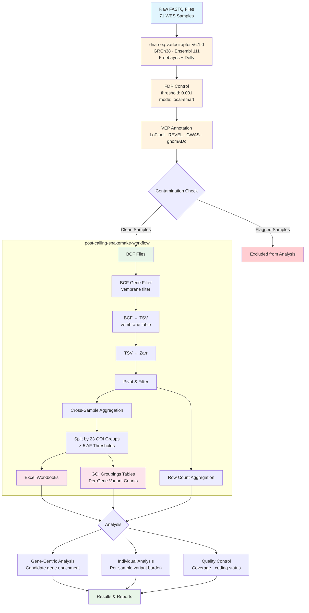

# WES_Analysis_11340_9740

<a target="_blank" href="https://cookiecutter-data-science.drivendata.org/">
    
</a>


## Links within the Project

- [Candidate Genes for association with Stuttering](references/README.md)
- [Workflow Overview](#2-workflow-overview)
- [Project Organization](#4-project-organization): Directory structure and file organization for the project.
- [Example Workflow Diagram](#5-example-workflow-diagram): Visual representation of the analysis pipeline.
- [Filtering Criteria and Steps](docs/filtering.md)
- [Individual Analysis Methodology](docs/individual_analysis.md)
- [Quality Control Workflow](docs/qc.md)

## Relationship to post-calling-snakemake-workflow

This repository contains **project-specific** documentation and ad-hoc analysis code for the stuttering WES project. The generic, reusable **pipeline** that processes the variant data is maintained separately:

- **Pipeline Repository**: [post-calling-snakemake-workflow](https://github.com/Speech-Neurophysiology-Lab/post-calling-snakemake-workflow) — Snakemake workflow for BCF → TSV → Zarr → Aggregation → GOI Analysis
- **This Repository**: Project-specific methodology (filtering rationale, gene selection, individual analysis, QC), ad-hoc analysis notebooks, and reference gene lists for the 11340/9740 stuttering cohort


# WES Data Analysis Workflow for Variant Identification

## Timeline

> **Note:** The original Gantt chart timeline (April–September 2025) has been archived. See [docs/archive/timeline.md](docs/archive/timeline.md) for the original timeline.

### Project Milestones

| Milestone | Status | Date |
|-----------|--------|------|
| DNA Submitted | Completed | April 2025 |
| Sequencing Completed | Completed | June 2025 |
| Data Transfer | Completed | June 2025 |
| Variant Calling (dna-seq-varlociraptor) | Completed | July 2025 |
| Post-Processing Pipeline (Snakemake) | Completed | October 2025 |
| GOI Analysis Extension | Completed | December 2025 |
| Individual Analysis & QC | Completed | December 2025 |


## 1. Introduction

### 1.1 Purpose
This document describes the workflow used to analyze Whole Exome Sequencing (WES) data from 71 samples sequenced by Illumina. The primary goal is to identify genetic variants that may be associated with stuttering, potentially enabling combined analysis with MRI data. The pipeline was initially validated on a subset of 12 samples before processing the full cohort.

### 1.2 Scope
This workflow covers the analysis of the 71 WES datasets from the 11340/9740 stuttering cohort. Analysis beyond these datasets is outside the scope of this document.


## 1.3 Prerequisites
- **Tools**:
    - [dna-seq-varlociraptor](https://github.com/snakemake-workflows/dna-seq-varlociraptor) v6.1.0 — variant calling pipeline
    - [Snakemake](https://snakemake.github.io/) ≥9.1.0 — workflow management
    - [post-calling-snakemake-workflow](https://github.com/Speech-Neurophysiology-Lab/post-calling-snakemake-workflow) — post-variant-calling processing
    - [vembrane](https://github.com/vembrane/vembrane) — VEP annotation extraction and filtering
    - [Conda](https://docs.conda.io/en/latest/)/[Mamba](https://mamba.readthedocs.io/) — environment and dependency management
    - [uv](https://docs.astral.sh/uv/) — Python package manager (for this analysis repo)
    - Python ≥3.10
    - SLURM — HPC job scheduling
- **Data**: 71 WES samples in FASTQ format
- **Access to Cluster Computing:**
    - Processing requires the University of Michigan Great Lakes HPC cluster.
    - **Job Scheduling:** SLURM for job management and scheduling.
    - **Package Management:** Conda/Mamba for pipeline environments; uv for analysis code.
- **Resources**:
  - [dna-seq-varlociraptor GitHub Repository](https://github.com/snakemake-workflows/dna-seq-varlociraptor)
  - [Snakemake workflow catalog — dna-seq-varlociraptor](https://snakemake.github.io/snakemake-workflow-catalog/docs/workflows/snakemake-workflows/dna-seq-varlociraptor.html)
  - [MSA-ChangLabUM Shared Folder on Dropbox](https://www.dropbox.com/home/MSA-ChangLabUM) (Access Required)
  - [Cookiecutter Data Science](https://cookiecutter-data-science.drivendata.org/) — project template used for this repository


### 1.4 Outcomes
- A well-documented dataset of identified variants, with FASTQ files, core facility documentation, MD5 checksums, and sample metadata.
- Aggregated variant tables stratified by 23 genes-of-interest groups at 5 allele frequency thresholds.
- Per-gene variant counts per sample for downstream correlation with MRI phenotypes.

> **Note:** Original expected outcomes and potential pitfalls from the planning phase have been archived. See [docs/archive/outcomes_and_pitfalls.md](docs/archive/outcomes_and_pitfalls.md).


### 1.5 Contamination Check

During analysis, some samples exhibited unexpected performance. A contamination check was performed to assess sample integrity, which resulted in removing affected samples from the final analysis.

- **Repository:** [contamination-check](https://github.com/Speech-Neurophysiology-Lab/contamination-check) (private — access required)
- **Method:** VerifyBamID2 and cross-sample concordance analysis
- **Outcome:** Samples flagged for contamination were excluded from downstream GOI analysis

### 1.6 References for Tools and Resources
- **Variant Calling Pipeline:** [dna-seq-varlociraptor](https://github.com/snakemake-workflows/dna-seq-varlociraptor) v6.1.0 (Ensembl release 111, GRCh38)
- **Post-Calling Pipeline:** [post-calling-snakemake-workflow](https://github.com/Speech-Neurophysiology-Lab/post-calling-snakemake-workflow)
- **Contamination Check:** [contamination-check](https://github.com/Speech-Neurophysiology-Lab/contamination-check) (private)
- **Annotation Filtering:** [vembrane](https://github.com/vembrane/vembrane)
- **Variant Caller:** [Varlociraptor](https://varlociraptor.github.io/)
- **VEP Plugins Used:** LoFtool, REVEL, GWAS, gnomADc
- **Shared Data:** [MSA-ChangLabUM on Dropbox](https://www.dropbox.com/home/MSA-ChangLabUM) (Access Required)
- **Snakemake:** [snakemake.github.io](https://snakemake.github.io/)
- **Zarr Format:** [zarr.dev](https://zarr.dev/)


## 2. Workflow Overview

The analysis process involves several key steps:

### 2.1 Data Storage and Access
- **Step 1:** Download raw sequencing data (fastq files) and associated documentation.
- **Step 2:** Verify the integrity of the downloaded FASTQ files by checking their MD5 checksums.
    - Compare the MD5 values of the downloaded files with the provided MD5 checksum file.
- **Primary Storage:** Great Lakes cluster
    - **Location:** `/nfs/turbo/umms-sooeunc/data/9790-JD`
    - **Location:** `/nfs/turbo/umms-sooeunc/data/13340-JD`
- **Backup Location:** Dropbox and/or DataDen
    - **Dropbox:** MSA-ChangLabUM/ImagingGenetics/DNA processing/seq_data_backup
- **Access:** Ensure appropriate permissions are set for team members.
- **Analysis Location:** `/nfs/turbo/umms-sooeunc/analysis/WES_varloc/`


### 2.2 Data Preparation (Variant Calling)

Variant calling was performed using [dna-seq-varlociraptor](https://github.com/snakemake-workflows/dna-seq-varlociraptor) **v6.1.0**, loaded as a Snakemake module (requires Snakemake ≥9.1.0).

**Pipeline Configuration:**
- **Reference genome:** GRCh38 (Ensembl release 111, 25 chromosomes)
- **Variant callers:** Freebayes + Delly (structural variants)
- **FDR control:** 0.001 threshold, `local-smart` mode
- **Candidate filter:** Excludes LOW impact, KI/GL chromosomes, and a specific chr2 region
- **Gene list filter:** Restricted to genes in `config/super_interesting_genes.tsv`
- **VEP annotation:** `--everything --check_existing` with plugins: LoFtool, REVEL, GWAS, gnomADc
- **Duplicate handling:** MarkDuplicates with `SORTING_COLLECTION_SIZE_RATIO=0.1`

**Setup steps:**
1. Deploy using `contrib/deploy_dna-seq-varlociraptor_v5.16.0.sh` (initial deployment), then updated to v6.1.0 via Snakemake module system.
2. Configure `samples.tsv`, `units.tsv`, `scenario.yaml`, and `config.yaml`.
3. Process raw FASTQ files through the pipeline.
    - **Output:** BCF files per sample with variant calls and VEP annotations.

### 2.3 Post-Varlociraptor Data Processing

Post-variant-calling data processing is handled by the [post-calling-snakemake-workflow](https://github.com/Speech-Neurophysiology-Lab/post-calling-snakemake-workflow) Snakemake pipeline. This automates the following steps:

- **BCF → TSV Conversion**: Using `vembrane table` to extract variant annotations
- **TSV → Zarr Conversion**: Efficient columnar storage for large datasets
- **Pivot & Aggregation**: Cross-sample grouping and aggregation with configurable row/position count cutoffs
- **GOI Group Analysis**: Stratification across 23 gene groups at 5 allele frequency thresholds, with Excel workbook output
- **Optional Gene & AF Filtering**: Configurable at the BCF level and during GOI analysis

See the [pipeline README](https://github.com/Speech-Neurophysiology-Lab/post-calling-snakemake-workflow/blob/main/README.md) for full pipeline documentation, and [docs/goi_analysis.md](https://github.com/Speech-Neurophysiology-Lab/post-calling-snakemake-workflow/blob/main/docs/goi_analysis.md) for GOI analysis details.


### 2.4 Analysis
- **Filtering:** The aggregated variant set was filtered to remove common variants (population AF thresholds at 10%, 5%, 3%, 1%) and variants appearing in too many samples (potential artifacts). See [docs/filtering.md](docs/filtering.md) for full criteria.
- **Gene-Centric Analysis:** Variants were grouped by gene and stratified across 23 GOI groups covering speech/language, neurodevelopmental, craniofacial, synaptic, signaling, and evolutionary gene categories.
- **Individual Analysis:** Per-individual variant burden was characterized across chromosomes, stratified by gene group membership, coding status, and variant class. See [docs/individual_analysis.md](docs/individual_analysis.md).
- **Quality Control:** Gene selection was validated for coding status, variant class distribution, and count consistency. See [docs/qc.md](docs/qc.md).
- **Contamination Check:** Sample integrity was verified using VerifyBamID2; contaminated samples were excluded. See [contamination-check](https://github.com/Speech-Neurophysiology-Lab/contamination-check) (private).


## 3. Analysis Considerations

- **Sample Size:** With 71 samples, discovering novel gene associations with high statistical confidence is limited. The analysis focused on candidate gene enrichment rather than genome-wide discovery.
- **Leveraging Prior Knowledge:** The analysis used existing research identifying candidate genes for stuttering (23 curated GOI groups) to enable targeted investigation.
- **Contamination:** Some samples showed unexpected patterns and were excluded after contamination checks (see §1.5).
- **Outcome:** A well-documented, annotated variant dataset was produced. GOI-stratified results are available for downstream correlation with MRI phenotypes.

## 4. Project Organization


```
├── LICENSE
├── Makefile                  <- Convenience commands
├── README.md                 <- This file
├── pyproject.toml            <- Package metadata and tool config (ruff, etc.)
├── environment.yml           <- Conda environment definition
├── load_uv_env.sh            <- Script to activate uv-managed Python environment
├── config/
│   └── reference_genes.yaml  <- Curated gene reference configuration
├── contrib/
│   └── deploy_dna-seq-varlociraptor_v5.16.0.sh  <- Pipeline deployment script
├── data/
│   ├── raw/                  <- Original immutable data
│   ├── zarr/                 <- Zarr format intermediate data
│   ├── aggregated/           <- Cross-sample aggregated results
│   ├── combined/             <- Combined datasets
│   ├── groupby/              <- Grouped data for analysis
│   └── variants_of_interest/ <- Filtered variant subsets
├── docs/
│   ├── filtering.md          <- Filtering criteria and rationale
│   ├── individual_analysis.md <- Per-individual analysis methodology
│   ├── qc.md                 <- Quality control workflow
│   └── archive/              <- Archived planning documents
├── notebooks/                <- Jupyter notebooks for ad-hoc analysis
├── references/
│   ├── README.md             <- Candidate gene list documentation
│   ├── genes/                <- Gene reference files (GeneCards CSVs)
│   ├── bedfiles/             <- BED files for genomic regions
│   └── papers_combined/      <- Combined gene lists from publications
├── reports/
│   └── figures/              <- Generated figures
├── tests/
│   └── test_data.py          <- Data validation tests
├── workspace/                <- Working files and scratch space
└── WES_Analysis_11340_9740/  <- Python source code
    ├── __init__.py
    ├── config.py             <- Project configuration variables
    ├── dataset.py            <- Data loading and processing
    ├── combine_gene_references.py <- Combine gene lists from multiple sources
    ├── extract_tables_pdf.py <- Extract tables from PDF publications
    ├── reformat_GWAS_table.py <- Reformat GWAS catalog data
    ├── features.py           <- Feature engineering
    ├── plots.py              <- Visualization code
    └── modeling/             <- Model training and prediction
```

--------

## 5. Example Workflow Diagram



