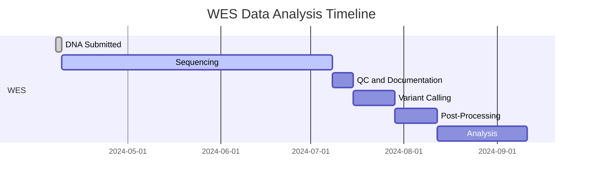
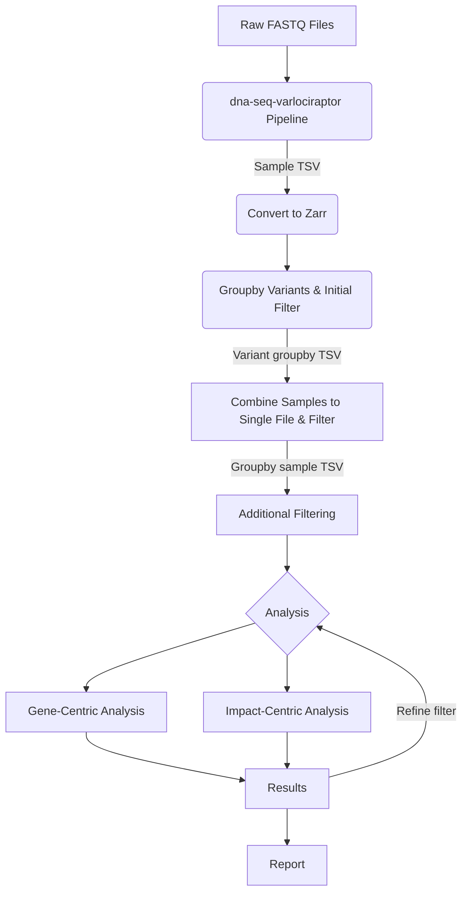

# WES_Analysis_11340_9740

<a target="_blank" href="https://cookiecutter-data-science.drivendata.org/">
    
</a>


# WES Data Analysis Workflow for Variant Identification

## Timeline





## 1. Introduction

### 1.1 Purpose
This document outlines the workflow for analyzing Whole Exome Sequencing (WES) data from 71 samples provided by Illumina. The primary goal is to identify genetic variants that may be associated with stuttering, potentially allowing for combined analysis with MRI data.  The initial workflow will be performed on a subset of 12 samples to validate the pipeline and identify any issues and reduce risk before processing the full dataset.

### 1.2 Scope
This workflow specifically covers the analysis of the 71 WES datasets mentioned. Analysis beyond these datasets is outside the scope of this document.


## 1.3 Prerequisites
- **Tools**:
    - dna-seq-varlociraptor pipeline
    - Snakemake
    - Slurm
    - Python
    - cookie cutter data science
    - Jupyter Notebook(TBD)
- **Data**: 71 WES samples in FASTQ format
- **Access to Cluster Computers for Data Processing:**
    - Due to the large size of the datasets, processing requires high-performance computing resources.
    - This workflow is designed to run on the Great Lakes cluster.
    - **Job Scheduling:** Utilize SLURM for job management and scheduling.
    - **Package Management:** Use Conda/Mamba to manage dependencies.
- **Resources**:
  - [dna-seq-varlociraptor GitHub Repository](https://github.com/snakemake-workflows/dna-seq-varlociraptor)
  - [MSA-ChangLabUM Shared Folder on Dropbox](https://www.dropbox.com/home/MSA-ChangLabUM)
  - [Modified dna-seq-varlociraptor Repository](https://github.com/delpropo/dna-seq-varlociraptor):
  A forked version of the dna-seq-varlociraptor pipeline, optimized for the Great Lakes cluster. This version includes an additional rule to create a final TSV file.
  - [Conda Documentation](https://docs.conda.io/projects/conda/en/latest/user-guide/index.html): For managing dependencies and environments.
  - [Snakemake workflow catalog documentation](https://snakemake.github.io/snakemake-workflow-catalog/docs/workflows/snakemake-workflows/dna-seq-varlociraptor.html): For instructions on setting up the pipeline with snakedeploy
  - [Cookiecutter Data Science](https://cookiecutter-data-science.drivendata.org/) Template for post variant calling analysis.


### 1.4 Expected Outcomes
- A well-documented dataset of identified variants, suitable for future research, regardless of whether variants directly linkable to stuttering are found.
- Sequencing should be completed in late June or July 2025 and final analysis should be completed by September 2025.
- **Minimum Deliverable**: Well-documented WES dataset even if no significant variants are found.
    - Fastq files, associated documents from the core, md5 checksum files, tables with sample id and metadata.
- **Best Case:** Identification of one or more variants strongly associated with stuttering, enabling correlation studies with existing MRI data.

### 1.5 Potential Pitfalls
- **Data Availability:** The raw sequencing data (fastq files) are expected in late June or July 2025, but delays are possible.
- **Sequencing Failure:** There is a possibility of low quality sequencing data or failures in one or more samples when the WES is completed.  Analysis will be performed on the data that is available.
- **Timeline and funding:** The project is funded until September 2025, and any delays in data availability may impact the analysis timeline.
- **Pipeline Issues:** Variant identification pipelines are always improving.  The current pipeline may miss variants or not have enough annotation.  Pipeline risk will be reduced by running it on the initial 12 samples.
- **Storage:** The size of the data may be larger than expected, and storage space should be monitored.  A large number of intermediary files can be created during WES analysis.  Additional storage may be needed on the Great Lakes cluster or modifications.
- 7.7TB of 20TB in use as of 4/24/25


### 1.6 References
- **Variant Analysis Pipeline:** [dna-seq-varlociraptor GitHub Repository](https://github.com/snakemake-workflows/dna-seq-varlociraptor)
- **Shared Data:** [MSA-ChangLabUM Shared Folder on Dropbox](https://www.dropbox.com/home/MSA-ChangLabUM) (Access Required)
- **Vembrane:** [vembrane GitHub Repository](https://github.com/vembrane/vembrane)

## 2. Workflow Overview

The analysis process involves several key steps:

### 2.1 Data Storage and Access
- **Step 1:** Download raw sequencing data (fastq files) and associated documentation.
- **Step 2:** Verify the integrity of the downloaded FASTQ files by checking their MD5 checksums.
    - Compare the MD5 values of the downloaded files with the provided MD5 checksum file.
- **Primary Storage:** Great Lakes cluster
    - **Location:** `/path/on/dataden/` (TBD)
- **Backup Location:** Dropbox and/or DataDen
    - **Location:** `/path/on/dataden/` (TBD)
- **Access:** Ensure appropriate permissions are set for team members.


### 2.2 Data Preparation (Variant Calling)
- **Step 1:** Install the `dna-seq-varlociraptor` pipeline using the `deploy_dna-seq-varlociraptor_v5.16.0.sh` script. This script performs the following actions:
    - Checks if Conda is installed.
    - Checks if a Conda environment named `varloc_env` already exists. If not, it creates the environment.
    - Activates the `varloc_env` environment.
    - Installs `mamba`, `snakedeploy`, and `snakemake` using Conda/Mamba.
    - Deploys the `dna-seq-varlociraptor` workflow (version 5.16.0) into the specified directory using `snakedeploy`.  Note that the final version of the pipeline may use a different version as updates are made.
- **Step 2** Setup the `dna-seq-varlociraptor` pipeline on the Great Lakes cluster.
    - Create the `samples.tsv` file to define the sample metadata, including sample IDs and associated information.
    - Create the `units.tsv` file to specify the sequencing units, such as FASTQ file paths and read group information.
    - Configure the `scenario.yaml` file to define the analysis scenario, including variant calling parameters and reference genome details.
    -  Edit the `config.yaml` file to set global pipeline parameters, such as output directories, resource allocation, and filtering thresholds.
- **Step 3** Process raw fastq files using the `dna-seq-varlociraptor` pipeline.
    - **Configuration:** Utilize the configuration files (`samples.tsv`, `units.tsv`, `scenario.yaml`, `config.yaml`) to define pipeline parameters and variant annotation settings.
    - **Filtering:** Apply minimal filtering at this stage (e.g., remove silent mutations, low-impact variants) to retain potentially relevant variants.
    - **Output:** Generate a Tab-Separated Values (TSV) file for each sample, containing detailed variant information.

### 2.3 Post-Varlociraptor Data Processing
- **Step 1:** Convert the individual sample TSV files into the Zarr format without modification. Zarr allows for efficient storage and retrieval of large datasets. The conversion from VCF to TSV is done by with `vembrane table` command and may be done manually outside of the `dna-seq-varlociraptor` pipeline. For more details, refer to the [vembrane GitHub Repository](https://github.com/vembrane/vembrane).
- **Step 2:** Read the Zarr file for each sample and output a reformatted TSV for each sample.
    - Filter to remove common variants based on allele frequency annotations.
    - Groupby unique variants as there are multiple rows for each variant due to annotations which can apply multiple values for each unique variant. This step ensures that the dataset is structured to combine sample genotypes information for each variant for downstream analysis, with each row representing a unique variant and its corresponding sample information.
    - A consolidated TSV file where each row contains a unique variant with annotation and the associated genotype for each details.

- **step 3:** Combine Individual Sample Files
    - Merge all individual sample TSV files into a single consolidated file with each row representing a unique variant with genotype information for each sample in columns.
    - Filter variants to remove variants which are too common across samples which will be defined.
    - Ensure that the consolidated file is structured for downstream analysis.
    - Save the consolidated file in TSV format for further filtering and analysis.


### 2.4 Analysis
- **Step 1 (Filtering):** Further filter the grouped TSV file to remove:
    - Common variants (using stricter frequency thresholds).
    - Identical variants appearing excessively across samples (potential sequencing artifacts).
    - Additional filtering criteria will be applied as necessary, based on the data and project requirements.
- **Step 2 (Gene-Centric Analysis):**
    - Group variants by gene.
    - Focus on genes previously implicated or suspected in stuttering.
    - Map identified variants to this list of candidate genes to assess potential correlations.
- **Step 3 (Variant-Impact Analysis):**
    - Search for variants predicted to have a significant impact on protein function (e.g., missense, nonsense, frameshift mutations).
    - Investigate the potential role of genes harboring these impactful variants in stuttering, even if not previously suspected.
- **Step 4 (Iterative Refinement)**
    - Refine filtering criteria based on initial findings.
    - Adjust analysis parameters to focus on variants of interest.
- **Step 5 (Reporting):**
    - Generate reports summarizing findings, including:
        - List of identified variants.
        - Gene-centric analysis results.
        - Variant-impact analysis results.
    - Visualizations to illustrate key findings and variant distributions.


## 3. Analysis Considerations

- **Sample Size:** Analyzing only 71 samples is relatively small for discovering novel gene associations with high statistical confidence. Finding multiple significant variants within a single gene across this cohort might be challenging.
- **Leveraging Prior Knowledge:** The analysis benefits significantly from existing research identifying candidate genes for stuttering. This allows for a more targeted investigation within this dataset.
- **Outcome Scenarios:**
    - **Best Case:** Clear identification of variants linked to stuttering.
    - **Worst Case:** No definitive stuttering-related variants found, but a valuable, annotated variant dataset is produced for future studies.

## 4. Project Organization


```
├── LICENSE            <- Open-source license if one is chosen
├── Makefile           <- Makefile with convenience commands like `make data` or `make train`
├── README.md          <- The top-level README for developers using this project.
├── data
│   ├── raw            <- The original, immutable data dump.
│   ├── zarr           <- Data stored in Zarr format for efficient access.
│   ├── groupby        <- Grouped data for analysis.
│   ├── combined       <- Combined datasets for modeling or reporting.
│   └── final          <- Finalized datasets ready for publication or archiving.
│
├── docs               <- A default mkdocs project; see www.mkdocs.org for details
│
├── config             <- Configuration files for the project, such as parameter settings or
│                         environment variables
├── contrib            <- Contributions from external collaborators, such as scripts or notebooks
├── models             <- Trained and serialized models, model predictions, or model summaries
│
├── notebooks          <- Jupyter notebooks. Naming convention is a number (for ordering),
│                         the creator's initials, and a short `-` delimited description, e.g.
│                         `1.0-jqp-initial-data-exploration`.
│
├── pyproject.toml     <- Project configuration file with package metadata for
│                         WES_Analysis_11340_9740 and configuration for tools like ruff
│
├── references         <- Data dictionaries, manuals, and all other explanatory materials.
│
├── reports            <- Generated analysis as HTML, PDF, LaTeX, etc.
│   └── figures        <- Generated graphics and figures to be used in reporting
│
│
└── WES_Analysis_11340_9740   <- Source code for use in this project.
    │
    ├── __init__.py             <- Makes WES_Analysis_11340_9740 a Python module
    │
    ├── config.py               <- Store useful variables and configuration
    │
    ├── dataset.py              <- Scripts to download or generate data
    │
    ├── features.py             <- Code to create features for modeling
    │
    ├── modeling
    │   ├── __init__.py
    │   ├── predict.py          <- Code to run model inference with trained models
    │   └── train.py            <- Code to train models
    │
    └── plots.py                <- Code to create visualizations
```

--------

## 5. Example Workflow Diagram



