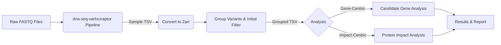

# WES_Analysis_11340_9740

<a target="_blank" href="https://cookiecutter-data-science.drivendata.org/">
    
</a>

Multisample WES variant analysis
========================================


# WES Data Analysis Workflow for Variant Identification

This document outlines the workflow for analyzing Whole Exome Sequencing (WES) data from 71 samples provided by Illumina. The primary goal is to identify genetic variants that may be associated with stuttering, potentially allowing for combined analysis with MRI data.  The initial workflow will be performed on a subset of 12 samples to validate the pipeline and identify any issues and reduce risk before processing the full dataset.


## 1. Introduction

### 1.1 Purpose
To define a standardized workflow for analyzing 71 WES datasets to identify genetic variants potentially linked to stuttering.

### 1.2 Scope
This workflow specifically covers the analysis of the 71 WES datasets mentioned. Analysis beyond these datasets is outside the scope of this document.

### 1.3 Prerequisites
- Access to the `dna-seq-varlociraptor` pipeline.
- Proficiency in Python programming.
- Familiarity with Jupyter Notebook for data analysis and visualization.

## 1.3 Prerequisites
- **Tools**: dna-seq-varlociraptor pipeline, Python, Jupyter Notebook
- **Data**: 71 WES samples in FASTQ format
- **Resources**:
  - [dna-seq-varlociraptor GitHub Repository](https://github.com/snakemake-workflows/dna-seq-varlociraptor)
  - [MSA-ChangLabUM Shared Folder on Dropbox](https://www.dropbox.com/home/MSA-ChangLabUM)

### 1.4 Expected Outcomes
- A well-documented dataset of identified variants, suitable for future research, regardless of whether variants directly linkable to stuttering are found.
- **Best Case:** Identification of one or more variants strongly associated with stuttering, enabling correlation studies with existing MRI data.

### 1.5 Potential Pitfalls
- **Data Availability:** The raw sequencing data (fastq files) are expected in late June or July 2025, but delays are possible.
- **Timeline:** Project funding is scheduled to end in September 2025.
- **Pipeline Issues:** Potential challenges with the `dna-seq-varlociraptor` pipeline might lead to missed variants, possibly requiring modifications. To mitigate this, an initial run on a subset of 12 samples will be performed.

### 1.6 References
- **Variant Analysis Pipeline:** [dna-seq-varlociraptor GitHub Repository](https://github.com/snakemake-workflows/dna-seq-varlociraptor)
- **Shared Data:** [MSA-ChangLabUM Shared Folder on Dropbox](https://www.dropbox.com/home/MSA-ChangLabUM) (Access Required)
- **Vembrane:** [vembrane GitHub Repository](https://github.com/vembrane/vembrane)

## 2. Workflow Overview

The analysis process involves several key steps:

### 2.1 Data Storage and Access
- **Action:** Download raw sequencing data (fastq files) and associated documentation.
- **Primary Storage:** Great Lakes cluster
- **Backup Location:** Dropbox and/or DataDen
- **Access:** Ensure appropriate permissions are set for team members.
- **Primary Storage:** `TBD`
- **Backup Location:** `TBD`
- **Access:** Ensure appropriate permissions are set for team members.

### 2.2 Data Preparation (Variant Calling)
- **Action:** Process raw fastq files using the `dna-seq-varlociraptor` pipeline.
- **Configuration:** Utilize the configuration file located in the `config/` directory to define pipeline parameters and variant annotation settings.
- **Filtering:** Apply minimal filtering at this stage (e.g., remove silent mutations, low-impact variants) to retain potentially relevant variants.
- **Output:** Generate a Tab-Separated Values (TSV) file for each sample, containing detailed variant information.

### 2.3 Post-Varlociraptor Data Processing
- **Action 1:** Convert the individual sample TSV files into the Zarr format without modification. Zarr allows for efficient storage and retrieval of large datasets. The conversion from VCF to TSV is done by with `vembrane table` command and may be done manually outside of the `dna-seq-varlociraptor` pipeline. For more details, refer to the [vembrane GitHub Repository](https://github.com/vembrane/vembrane).
- **Action 2:** Read the Zarr files and process them to create a single, grouped TSV file.
- **Filtering:** Apply initial filtering to remove common variants based on allele frequency annotations or other criteria.
- **Grouping:** Group the data by unique variants across all samples.

### 2.4 Analysis
- **Action 1 (Filtering):** Further filter the grouped TSV file to remove:
    - Common variants (using stricter frequency thresholds).
    - Variants appearing excessively across samples (potential sequencing artifacts).
    - Additional filtering criteria will be applied as necessary, based on the data and project requirements.
- **Action 2 (Gene-Centric Analysis):**
    - Group variants by gene.
    - Focus on genes previously implicated or suspected in stuttering.
    - Map identified variants to this list of candidate genes to assess potential correlations.
- **Action 3 (Variant-Impact Analysis):**
    - Search for variants predicted to have a significant impact on protein function (e.g., missense, nonsense, frameshift mutations).
    - Investigate the potential role of genes harboring these impactful variants in stuttering, even if not previously suspected.

## 3. Potential Issues and Considerations

- **Sample Size:** Analyzing only 71 samples is relatively small for discovering novel gene associations with high statistical confidence. Finding multiple significant variants within a single gene across this cohort might be challenging.
- **Leveraging Prior Knowledge:** The analysis benefits significantly from existing research identifying candidate genes for stuttering. This allows for a more targeted investigation within this dataset.
- **Outcome Scenarios:**
    - **Best Case:** Clear identification of variants linked to stuttering.
    - **Worst Case:** No definitive stuttering-related variants found, but a valuable, annotated variant dataset is produced for future studies.

## 4. Project Organization


```
├── LICENSE            <- Open-source license if one is chosen
├── Makefile           <- Makefile with convenience commands like `make data` or `make train`
├── README.md          <- The top-level README for developers using this project.
├── data
│   ├── raw            <- The original, immutable data dump.
│   ├── zarr           <- Data stored in Zarr format for efficient access.
│   ├── groupby        <- Grouped data for analysis.
│   ├── combined       <- Combined datasets for modeling or reporting.
│   └── final          <- Finalized datasets ready for publication or archiving.
│
├── docs               <- A default mkdocs project; see www.mkdocs.org for details
│
├── config             <- Configuration files for the project, such as parameter settings or
│                         environment variables
├── contrib            <- Contributions from external collaborators, such as scripts or notebooks
├── models             <- Trained and serialized models, model predictions, or model summaries
│
├── notebooks          <- Jupyter notebooks. Naming convention is a number (for ordering),
│                         the creator's initials, and a short `-` delimited description, e.g.
│                         `1.0-jqp-initial-data-exploration`.
│
├── pyproject.toml     <- Project configuration file with package metadata for
│                         WES_Analysis_11340_9740 and configuration for tools like black
│
├── references         <- Data dictionaries, manuals, and all other explanatory materials.
│
├── reports            <- Generated analysis as HTML, PDF, LaTeX, etc.
│   └── figures        <- Generated graphics and figures to be used in reporting
│
├── requirements.txt   <- The requirements file for reproducing the analysis environment, e.g.
│                         generated with `pip freeze > requirements.txt`
│
├── setup.cfg          <- Configuration file for flake8
│
└── WES_Analysis_11340_9740   <- Source code for use in this project.
    │
    ├── __init__.py             <- Makes WES_Analysis_11340_9740 a Python module
    │
    ├── config.py               <- Store useful variables and configuration
    │
    ├── dataset.py              <- Scripts to download or generate data
    │
    ├── features.py             <- Code to create features for modeling
    │
    ├── modeling
    │   ├── __init__.py
    │   ├── predict.py          <- Code to run model inference with trained models
    │   └── train.py            <- Code to train models
    │
    └── plots.py                <- Code to create visualizations
```

--------

## 5. Example Workflow Diagram

*(A flowchart/diagram illustrating the steps from raw data to final analysis would be beneficial here. This can be created using tools like draw.io, Lucidchart, or Mermaid syntax within Markdown if supported).*



---
*This document provides a high-level overview. Detailed parameters and specific commands will be documented within the respective script headers, configuration files, and Jupyter notebooks.*
