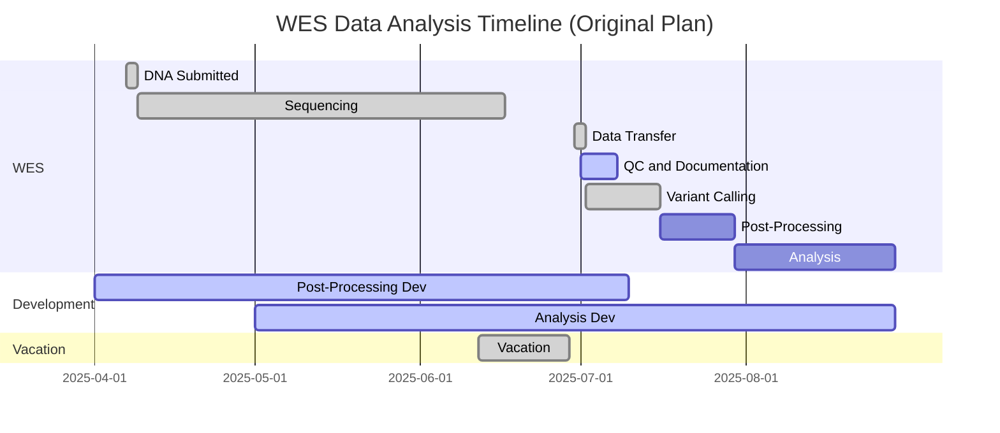

# Original Project Timeline (Archived)

> **Note:** This timeline was created at project inception (April 2025) and is preserved for historical reference. It no longer reflects current project status. See the main [README.md](../../README.md) for current milestone status.

