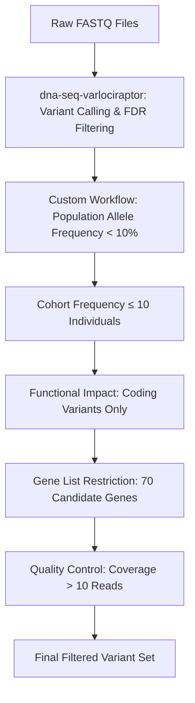

## Filtering Workflow Overview

Variant identification and filtering in this project is performed in two main stages:
1. **Initial Variant Calling & FDR Filtering:**
  - Performed using the dna-seq-varlociraptor workflow.
  - Applies a highly stringent FDR threshold to maximize specificity.
2. **Custom Downstream Filtering:**
  - Additional filtering steps are applied using a custom workflow to refine the variant set for genotype-phenotype analysis.

## Filtering Steps

1. **Variant Calling & FDR Filtering (dna-seq-varlociraptor)**
  - **FDR Threshold:** 0.001
  - **Purpose:** Maximize specificity and minimize false positives in initial variant calls.
  - **Justification:**
  We set a highly stringent FDR threshold (0.1%) for variant calling to maximize the specificity of variant detection. Given the study’s aim to associate rare coding variants with MRI-derived phenotypes, particularly in small case groups, it is essential to minimize false positive variant calls. The inclusion of individuals incorrectly assigned as variant carriers (false positives) would dilute the association signal and could generate misleading correlations. By using an FDR of 0.001 instead of the more typical 0.05, we ensure that identified carriers have a very high likelihood of harboring the variant, preserving the validity of the group-wise comparisons, even at the potential expense of missing some true variant carriers (false negatives).

2. **Population Allele Frequency**
  - **Cutoff:** <10%
  - **Purpose:** Exclude common variants unlikely to be associated with the phenotype.
  - **Justification:**
  Variants were filtered to include only those with a minor allele frequency (MAF) below 10% in public databases (e.g., gnomAD, 1000 Genomes). This threshold was chosen because the phenotype of interest, stuttering, occurs in approximately 5–10% of the population. Thus, a lower allele frequency cutoff (e.g., <1%) would risk excluding variants genuinely associated with the trait. The 10% threshold balances the need to include potentially relevant variants while excluding common benign polymorphisms.

3. **Cohort Frequency**
  - **Criterion:** Variant must occur in ≤10 individuals.
  - **Purpose:** Focus on rare or less common variants within the study cohort.

4. **Functional Impact**
  - **Criterion:** Coding variants only.
  - **Purpose:** Restrict analysis to variants likely to affect protein function.

5. **Gene List Restriction**
  - **Criterion:** Located within a curated list of candidate genes.
  - **Purpose:** Focus on biologically plausible candidates.

6. **Quality Control**
  - **Coverage filter:** >10 sequence reads.
  - **Purpose:** Ensure variant calls are supported by sufficient evidence.

---

## Filtering Workflow Diagram

---

**Summary:**
This filtering strategy is designed to detect rare-to-intermediate frequency coding variants with high confidence in a well-defined set of candidate genes, balancing sensitivity (with a 10% population frequency cutoff) and specificity (with a 0.001 FDR threshold), in order to most robustly identify variants suitable for downstream correlation with MRI-derived phenotypes in the context of stuttering.
