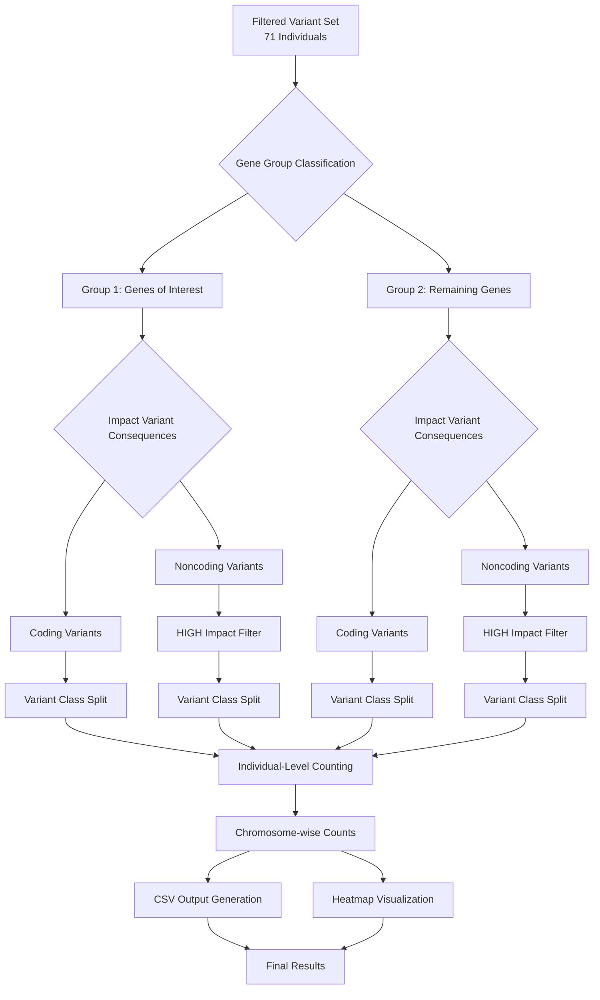

## Individual Analysis Workflow Overview

Individual-level analysis in this project focuses on characterizing variant
burden and chromosomal distribution patterns across 71 individuals (sample_1
to sample_71). This analysis is performed after the filtering workflow and
involves:

1. **Gene Group Stratification:**
  - Segregation of variants into genes of interest vs. remaining genes.
  - Systematic analysis of variant burden patterns across both groups.

2. **Functional Impact:**
  - Separation of variants into coding and noncoding categories.
  - High-impact filtering for noncoding variants to focus on functionally
    relevant changes.
  - Variant class stratification using ANN['VARIANT_CLASS'] annotations.

## Analysis Steps

1. **Gene Group Classification**
  - **Group 1:** All variants located in genes of interest (candidate genes)
  - **Group 2:** All variants in remaining genes (non-candidate genes)
  - **Purpose:** Compare variant burden patterns between biologically relevant
    candidate genes and genome-wide background
  - **Justification:** This stratification allows assessment of whether
    stuttering-associated variants show enrichment patterns in candidate genes
    vs. background genomic regions

2. **Impact Variant Consequences**
  - **Coding Variants:** All variants in protein-coding regions
  - **Noncoding Variants:** Filtered to retain only HIGH impact annotations
  - **Purpose:** Focus analysis on variants most likely to have functional
    consequences
  - **Justification:** HIGH impact noncoding variants (e.g., splice site
    disruptions, regulatory region changes) are more likely to contribute to
    phenotypic variation than low-impact noncoding changes

### HIGH Impact Variant Consequences (Ensembl Classification)

| SO Term | Description | SO ID | Display Term | Impact |
|---------|-------------|-------|--------------|--------|
| transcript_ablation | A feature ablation whereby the deleted region includes a transcript feature | SO:0001893 | Transcript ablation | HIGH |
| splice_acceptor_variant | A splice variant that changes the 2 base region at the 3' end of an intron | SO:0001574 | Splice acceptor variant | HIGH |
| splice_donor_variant | A splice variant that changes the 2 base region at the 5' end of an intron | SO:0001575 | Splice donor variant | HIGH |
| stop_gained | A sequence variant whereby at least one base of a codon is changed, resulting in a premature stop codon, leading to a shortened transcript | SO:0001587 | Stop gained | HIGH |
| frameshift_variant | A sequence variant which causes a disruption of the translational reading frame, because the number of nucleotides inserted or deleted is not a multiple of three | SO:0001589 | Frameshift variant | HIGH |
| stop_lost | A sequence variant where at least one base of the terminator codon (stop) is changed, resulting in an elongated transcript | SO:0001578 | Stop lost | HIGH |
| start_lost | A codon variant that changes at least one base of the canonical start codon | SO:0002012 | Start lost | HIGH |
| transcript_amplification | A feature amplification of a region containing a transcript | SO:0001889 | Transcript amplification | HIGH |
| feature_elongation | A sequence variant that causes the extension of a genomic feature, with regard to the reference sequence | SO:0001907 | Feature elongation | HIGH |
| feature_truncation | A sequence variant that causes the reduction of a genomic feature, with regard to the reference sequence | SO:0001906 | Feature truncation | HIGH |

*Source: [Ensembl Variation - Calculated variant consequences](https://grch37.ensembl.org/info/genome/variation/prediction/predicted_data.html)*

3. **Variant Class Analysis**
  - **Primary Classes:** SNV (single nucleotide variants) - expected majority
  - **Secondary Classes:** Insertions, deletions, and other structural variants
  - **Method:** Classification using ANN['VARIANT_CLASS'] annotations
  - **Purpose:** Assess whether different variant types show distinct
    chromosomal distribution patterns

4. **Individual-Level Variant Counting**
  - **Scope:** Variant counts per chromosome for each of 71 individuals
  - **Stratification:** Separate counts for each combination of:
    - Gene group (candidate vs. non-candidate)
    - Coding status (coding vs. high-impact noncoding)
    - Variant class (SNV, insertion, deletion, etc.)
  - **Purpose:** Identify individual-specific and chromosome-specific variant
    burden patterns

5. **Output Generation and Visualization**
  - **CSV Files:** Summary tables of variant counts per chromosome per
    individual for each gene group, coding status, and variant class combination
  - **Heatmaps:**
    - X-axis: Individuals (sample_1 to sample_71)
    - Y-axis: Chromosomes (1-22, X, Y)
    - Color intensity: Number of variants
    - Separate heatmaps for each stratification combination

---

## Individual Analysis Workflow Diagram

---

**Summary:**
This individual analysis strategy systematically characterizes variant burden
patterns across 71 individuals by stratifying variants into biologically
meaningful categories. The approach begins with gene group classification
(candidate genes vs. genome-wide background), followed by functional impact
assessment (coding vs. high-impact noncoding variants), and variant class
stratification. Individual-level chromosome-wise variant counting enables
identification of burden patterns and potential hotspots. Comprehensive CSV
outputs and heatmap visualizations facilitate interpretation of variant
distribution patterns across individuals and chromosomes. This systematic
approach complements the filtering workflow by providing detailed individual-level
insights into rare variant burden in the context of stuttering genetics.

---

## References

1. Ensembl Variation - Calculated variant consequences. Available at: https://grch37.ensembl.org/info/genome/variation/prediction/predicted_data.html

2. Ensembl Variation - Pathogenicity predictions. Available at: https://grch37.ensembl.org/info/genome/variation/prediction/protein_function.html

3. Ensembl VEP Formats Documentation. Available at: https://useast.ensembl.org/info/docs/tools/vep/vep_formats.html
