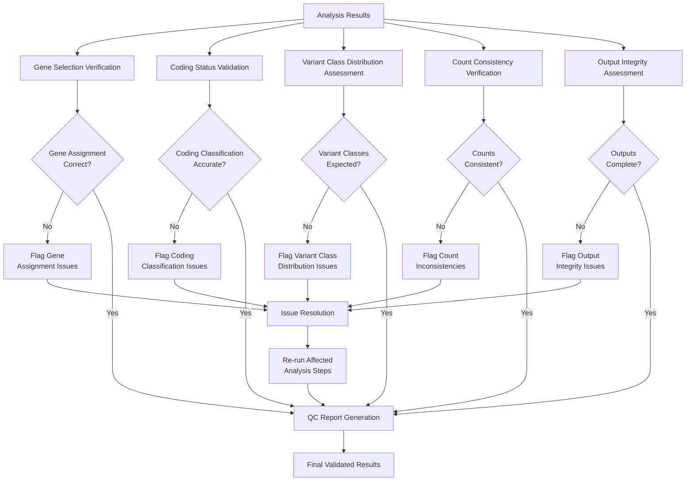

## Quality Control Workflow Overview

Quality control validation is performed as an independent assessment to ensure
data integrity and analysis accuracy across all stratification steps in the
individual variant burden analysis. This validation process runs parallel to
the main analysis workflow and provides systematic checks at each
classification and counting step.

## Quality Control Steps

1. **Gene Selection Verification**
  - **Check:** Confirm correct assignment to candidate vs. non-candidate gene groups
  - **Method:** Cross-reference gene lists with predefined candidate gene sets
  - **Validation:** Ensure no genes are misclassified or missing from assignments

2. **Coding Status Validation**
  - **Check:** Verify coding/noncoding classification accuracy
  - **Method:** Compare annotations against reference transcriptome
  - **HIGH Impact Filter Validation:** Confirm appropriate filtering criteria
    for noncoding variants

3. **Variant Class Distribution Assessment**
  - **Check:** Confirm SNV predominance and appropriate handling of other variant types
  - **Method:** Statistical summary of variant class frequencies
  - **Validation:** Flag unexpected distributions or missing variant classes

4. **Count Consistency Verification**
  - **Check:** Cross-validate variant counts across all stratifications
  - **Method:** Sum counts across categories should equal total input variants
  - **Individual-Level Validation:** Verify chromosome-wise counts per individual

5. **Output Integrity Assessment**
  - **Check:** Validate CSV file completeness and heatmap data consistency
  - **Method:** Compare output summaries with intermediate count files
  - **Visualization Validation:** Ensure heatmap color scales accurately
    represent underlying count data

---

## Quality Control Workflow Diagram

---

**Summary:**
Independent quality control validation ensures the reliability and accuracy of
variant burden analysis results. This systematic approach identifies potential
issues in gene classification, functional annotation, variant class assignment,
and count consistency before final result interpretation. The parallel QC
workflow enables rapid identification and resolution of data integrity issues
without disrupting the main analysis pipeline.
